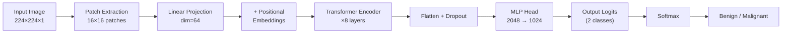
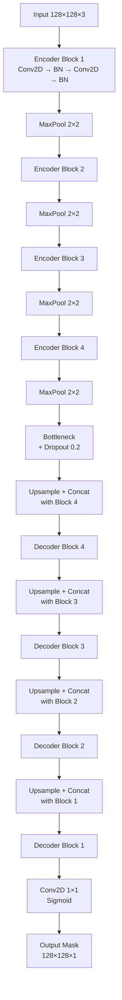

# AI Algorithms & Model Pipeline

## Overview

EarlyVision uses two specialized deep learning models, each tailored to a specific imaging modality:

| Model                | Architecture             | Task                  | Input             | Output             |
| -------------------- | ------------------------ | --------------------- | ----------------- | ------------------ |
| **Mammogram Model**  | Vision Transformer (ViT) | Binary Classification | 224×224 Grayscale | Benign / Malignant |
| **Ultrasound Model** | U-Net                    | Semantic Segmentation | 128×128 RGB       | Tumor Mask         |

---

## 1. Mammogram Classification — Vision Transformer (ViT)

### Architecture

The ViT model is a custom implementation inspired by [Dosovitskiy et al., 2020](https://arxiv.org/abs/2010.11929), adapted for single-channel grayscale mammogram images.



### Hyperparameters

| Parameter                | Value                     |
| ------------------------ | ------------------------- |
| Input Size               | 224 × 224 × 1 (Grayscale) |
| Patch Size               | 16 × 16                   |
| Number of Patches        | 196 (14 × 14)             |
| Projection Dimension     | 64                        |
| Transformer Layers       | 8                         |
| Attention Heads          | 4                         |
| Key Dimension            | 64                        |
| Transformer MLP Units    | [128, 64]                 |
| Classification MLP Units | [2048, 1024]              |
| Dropout (Transformer)    | 0.1                       |
| Dropout (Classifier)     | 0.5                       |
| Activation               | GELU                      |

### Component Details

#### Patch Extraction (`Patches` Layer)

Divides the input image into non-overlapping 16×16 pixel patches using `keras.ops.image.extract_patches`. Each patch is flattened into a vector of length `16 × 16 × 1 = 256`.

#### Patch Encoding (`PatchEncoder` Layer)

Each patch vector is linearly projected to a 64-dimensional embedding, then summed with a learnable positional embedding (one per patch position) to encode spatial information.

#### Transformer Encoder (×8 Blocks)

Each block follows the standard architecture:

1. **Layer Normalization** (ε = 1e-6)
2. **Multi-Head Self-Attention** (4 heads, key_dim=64, dropout=0.1)
3. **Residual Connection** (Add attention output to input)
4. **Layer Normalization**
5. **MLP** (Dense 128 → GELU → Dropout → Dense 64 → GELU → Dropout)
6. **Residual Connection** (Add MLP output to attention output)

#### Classification Head

- Flatten all patch representations
- Dropout (0.5)
- Dense 2048 → GELU → Dropout(0.5)
- Dense 1024 → GELU → Dropout(0.5)
- Dense 2 (logits)

### Training Details

| Parameter       | Value                                          |
| --------------- | ---------------------------------------------- |
| Dataset         | Mammogram Mastery (Kaggle)                     |
| Balancing       | Upsampling minority class                      |
| Train/Val Split | 80/20 (stratified)                             |
| Optimizer       | AdamW (lr=0.001, weight_decay=0.0001)          |
| Loss            | Sparse Categorical Cross-Entropy (from logits) |
| Batch Size      | 32                                             |
| Epochs          | 10 (with Early Stopping, patience=2)           |
| Augmentation    | Random Horizontal Flip, Random Rotation (±2%)  |
| Normalization   | `(pixel - 0.5) / 0.5` → range [-1, 1]          |

### Preprocessing Pipeline (Inference)

```
Raw Image Bytes
  → PIL Image (convert to Grayscale 'L')
  → Resize 224×224
  → NumPy array (float32)
  → Expand dims → (1, 224, 224, 1)
  → Normalize: (x - 0.5) / 0.5
  → Model Input
```

> **Important:** The normalization matches training exactly — no division by 255 is applied because the training pipeline's `layers.Normalization(mean=0.5, variance=0.25)` operates on raw [0, 255] pixel values.

### Prediction Logic

```python
logits = model.predict(processed_img)          # [1, 2]
probabilities = softmax(logits)                 # [prob_benign, prob_malignant]
label = "Malignant" if prob_malignant > prob_benign else "Benign"
confidence = max(prob_benign, prob_malignant)
```

---

## 2. Ultrasound Segmentation — U-Net

### Architecture

The U-Net model follows the encoder-decoder architecture from [Ronneberger et al., 2015](https://arxiv.org/abs/1505.04597), enhanced with BatchNormalization and Dropout.



### Key Parameters

| Parameter           | Value                                    |
| ------------------- | ---------------------------------------- |
| Input Size          | 128 × 128 × 3 (RGB)                      |
| Encoder Filters     | 16 → 32 → 64 → 128 → 256                 |
| Decoder Filters     | 128 → 64 → 32 → 16                       |
| Kernel Size         | 3 × 3                                    |
| Activation          | ReLU (encoder/decoder), Sigmoid (output) |
| Dropout             | 0.2 (bottleneck)                         |
| Batch Normalization | After each Conv2D block                  |
| Skip Connections    | Concatenation from encoder to decoder    |

### Training Details

| Parameter        | Value                                 |
| ---------------- | ------------------------------------- |
| Dataset          | Breast Ultrasound Images Dataset      |
| Train/Test Split | 90/10                                 |
| Optimizer        | Adam                                  |
| Loss             | Binary Cross-Entropy                  |
| Batch Size       | 16                                    |
| Epochs           | 50 (with Early Stopping, patience=10) |
| LR Reduction     | ReduceLROnPlateau (patience=5)        |
| Normalization    | `pixel / 255.0` → range [0, 1]        |

### Evaluation Metrics

| Metric                | Formula             |
| --------------------- | ------------------- | ----- | --- | ----- | --- | --- | --- |
| **Dice Coefficient**  | `2 \*               | A ∩ B | / ( | A     | +   | B   | )`  |
| **IoU (Jaccard)**     | `                   | A ∩ B | /   | A ∪ B | `   |
| **Standard Accuracy** | Pixel-wise accuracy |

### Preprocessing Pipeline (Inference)

```
Raw Image Bytes
  → OpenCV decode (BGR → kept as RGB by default)
  → Resize 128×128
  → Normalize: pixel / 255.0 → [0, 1]
  → Expand dims → (1, 128, 128, 3)
  → Model Input
```

### Post-Processing & Prediction Logic

```python
pred_mask = model.predict(input_tensor)    # (1, 128, 128, 1), values [0, 1]
mask = (pred_mask > 0.5).astype(uint8)     # Binary threshold
mask_2d = mask[0, :, :, 0] * 255          # Convert to 0/255 image

has_tumor = np.sum(mask_2d) > 0           # Any white pixels = tumor
confidence = float(np.max(pred_mask))      # Peak probability

# Encode mask as Base64 PNG for frontend overlay
_, buffer = cv2.imencode('.png', mask_2d)
mask_base64 = base64.b64encode(buffer).decode('utf-8')
```

---

## Model File Reference

| File                        | Size    | Description                         |
| --------------------------- | ------- | ----------------------------------- |
| `vit_mammogram_model.keras` | ~326 MB | ViT weights (Keras format)          |
| `ultrasound_unet_model.h5`  | ~89 MB  | U-Net weights (HDF5 format)         |
| `vit_mammogram.py`          | 12 KB   | ViT training notebook (reference)   |
| `Ultrasound.py`             | 18 KB   | U-Net training notebook (reference) |
