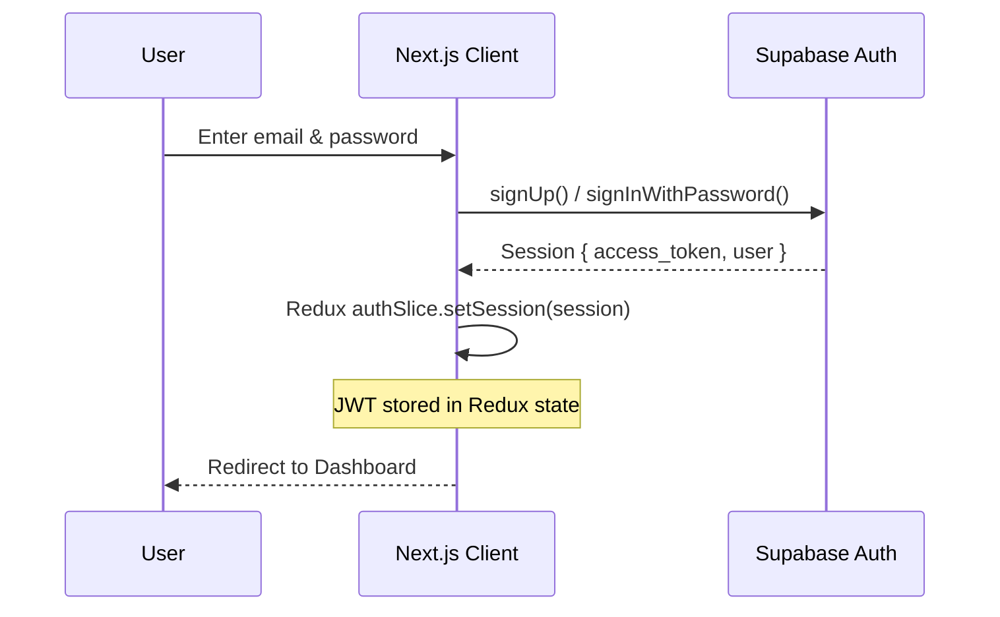
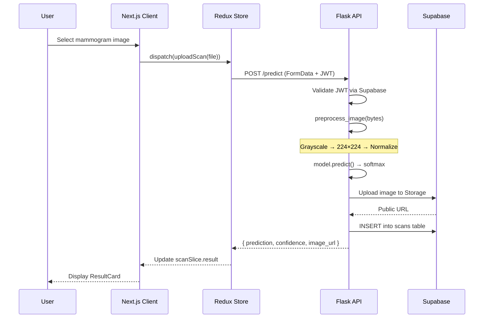
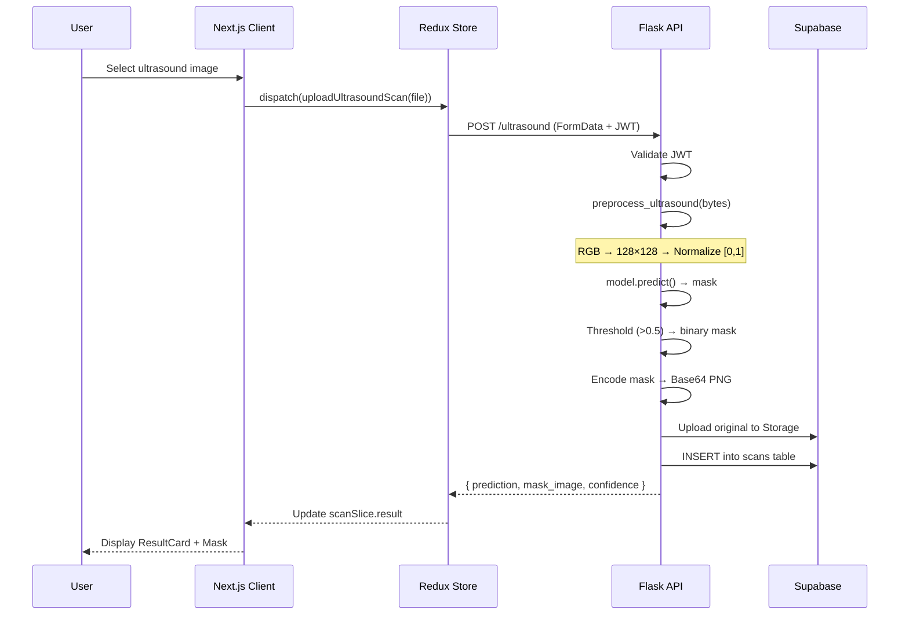
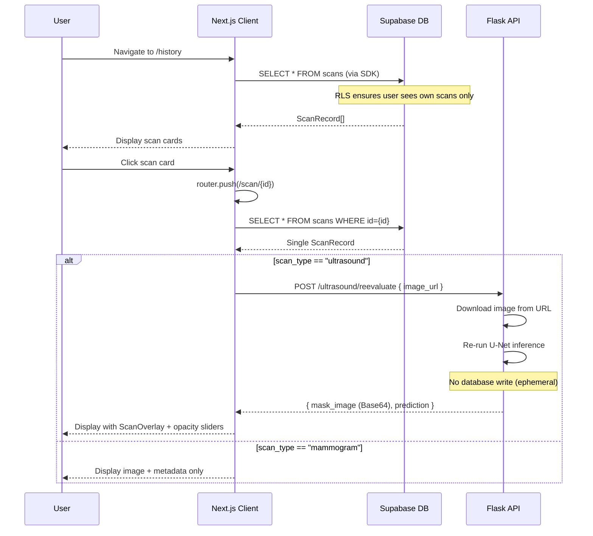
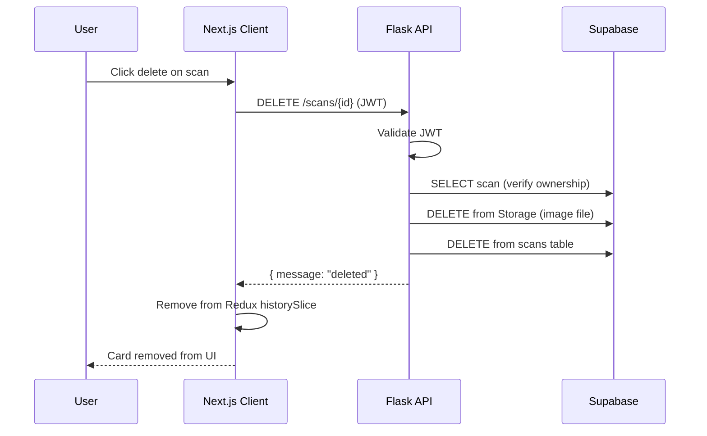

# Data Flow Documentation

## Overview

This document describes how data moves through the EarlyVision system for each major user flow: authentication, scan upload & prediction, history retrieval, and scan detail viewing.

---

## 1. Authentication Flow

**Token Lifecycle:**

- JWT access tokens issued by Supabase on login
- Tokens passed to Flask API via `Authorization: Bearer <token>` header
- Flask validates tokens by calling `supabase.auth.get_user(token)`
- Frontend checks session on page load via `checkSession()` thunk

---

## 2. Mammogram Upload & Prediction

**Data Transformations:**

1. `File` → `FormData` → HTTP multipart upload
2. Raw bytes → Grayscale PIL → 224×224 → float32 → normalized `[-1, 1]`
3. Model logits → softmax → `{label, confidence}`
4. Original bytes → Supabase Storage → public URL
5. Metadata → Supabase DB `scans` table

---

## 3. Ultrasound Upload & Segmentation

**Key Differences from Mammogram Flow:**

- Input is RGB (3 channels), not grayscale
- Output is a segmentation mask, not a class label
- Mask is encoded as Base64 PNG and sent inline (not stored in Supabase)
- Diagnosis derived from mask: `sum(mask) > 0` → tumor detected

---

## 4. History & Scan Details

**Re-evaluation Key Points:**

- The `/ultrasound/reevaluate` endpoint is **stateless** — it does not persist results
- This enables on-demand overlay generation from stored image URLs
- Opacity sliders (`imageOpacity`, `maskOpacity`) allow interactive visualization

---

## 5. Scan Deletion

---

## Data Storage Summary

| Data                | Location                              | Retention      |
| ------------------- | ------------------------------------- | -------------- |
| User credentials    | Supabase Auth                         | Permanent      |
| JWT tokens          | Redux state (memory)                  | Session-scoped |
| Scan metadata       | Supabase PostgreSQL `scans` table     | Until deleted  |
| Original images     | Supabase Storage `mammo-scans` bucket | Until deleted  |
| Segmentation masks  | Sent as Base64 in API response        | Not persisted  |
| Re-evaluation masks | Computed on-demand                    | Not persisted  |

## Environment Variables

| Variable                        | Location            | Purpose                           |
| ------------------------------- | ------------------- | --------------------------------- |
| `SUPABASE_URL`                  | `backend/.env`      | Backend Supabase connection       |
| `SUPABASE_KEY`                  | `backend/.env`      | Backend Supabase anon key         |
| `PORT`                          | `backend/.env`      | Flask server port (default: 5000) |
| `NEXT_PUBLIC_SUPABASE_URL`      | `client/.env.local` | Frontend Supabase connection      |
| `NEXT_PUBLIC_SUPABASE_ANON_KEY` | `client/.env.local` | Frontend Supabase anon key        |
| `NEXT_PUBLIC_API_URL`           | `client/.env.local` | Flask backend URL                 |
