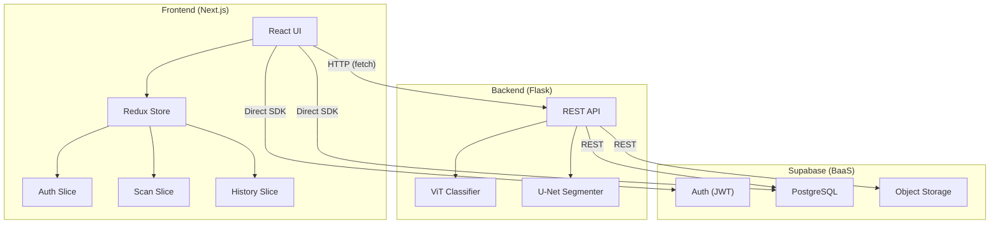

# System Architecture

## Overview

EarlyVision is a full-stack AI-powered breast cancer detection platform built on a three-tier architecture: a **Next.js frontend**, a **Flask backend** hosting TensorFlow/Keras models, and **Supabase** providing authentication, database, and file storage.



## Component Breakdown

### Frontend — Next.js 16 (App Router)

| Layer     | Technology      | Purpose                             |
| --------- | --------------- | ----------------------------------- |
| Framework | Next.js 16      | App Router, SSR, file-based routing |
| State     | Redux Toolkit   | Global state via `configureStore`   |
| Styling   | Tailwind CSS    | Utility-first CSS                   |
| Animation | Framer Motion   | Page transitions, hover effects     |
| Auth      | Supabase JS SDK | Session management, JWT tokens      |

**Key Routes:**

| Route               | Description                              |
| ------------------- | ---------------------------------------- |
| `/`                 | Dashboard with stats                     |
| `/mammogram`        | Mammogram upload & prediction            |
| `/ultrasound`       | Ultrasound upload & segmentation         |
| `/history`          | Scan archive with search/filter          |
| `/scan/[id]`        | Detailed scan view with overlay controls |
| `/login`, `/signup` | Authentication pages                     |

### Backend — Flask (Python)

| Component         | Technology         | Purpose                         |
| ----------------- | ------------------ | ------------------------------- |
| Framework         | Flask              | REST API server                 |
| CORS              | flask-cors         | Cross-origin request handling   |
| ML Framework      | TensorFlow / Keras | Model inference                 |
| Image Processing  | OpenCV, Pillow     | Preprocessing & mask generation |
| Auth Verification | Supabase REST      | JWT token validation            |

### Supabase

| Service        | Usage                                    |
| -------------- | ---------------------------------------- |
| **Auth**       | Email/password signup, JWT sessions      |
| **PostgreSQL** | `scans` table with RLS policies          |
| **Storage**    | `mammo-scans` bucket for uploaded images |

## Database Schema

```sql
create table public.scans (
  id uuid default gen_random_uuid() primary key,
  user_id uuid references auth.users(id) not null,
  original_image_url text not null,
  annotated_image_url text,
  prediction_label text,
  confidence_score float,
  created_at timestamptz default now() not null,
  scan_type text  -- 'mammogram' or 'ultrasound'
);
```

**Row Level Security (RLS):**

- Users can only `SELECT` their own scans (`auth.uid() = user_id`)
- Users can only `INSERT` their own scans (`auth.uid() = user_id`)
- Deletion is handled server-side via the Flask API with ownership verification

## State Management

The Redux store is organized into three slices:

| Slice          | State                                 | Async Thunks                         |
| -------------- | ------------------------------------- | ------------------------------------ |
| `authSlice`    | `user`, `session`, `loading`, `error` | `checkSession`, `signOut`            |
| `scanSlice`    | `scanning`, `result`, `error`         | `uploadScan`, `uploadUltrasoundScan` |
| `historySlice` | `scans[]`, `loading`, `error`         | `fetchHistory`, `deleteScan`         |

## Security Model

1. **Authentication**: Supabase Auth issues JWTs on login/signup
2. **API Authorization**: Flask endpoints extract the `Authorization: Bearer <token>` header and validate via `supabase.auth.get_user(token)`
3. **Data Isolation**: RLS on the `scans` table ensures users only access their own data
4. **Storage**: Images stored in Supabase Storage with user-scoped paths (`{user_id}/{uuid}.{ext}`)

## Deployment

| Component       | Platform          |
| --------------- | ----------------- |
| Frontend        | Netlify           |
| Backend         | Render            |
| Database & Auth | Supabase (hosted) |
